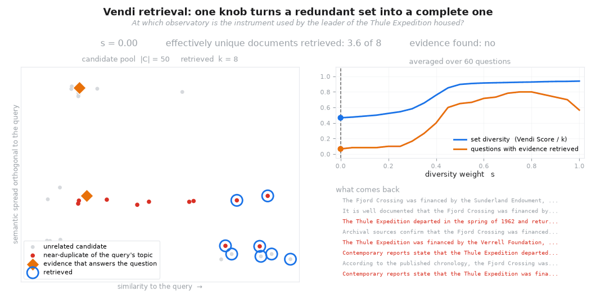

# Vendi-RAG

**Adaptively trading off diversity and quality significantly improves retrieval-augmented generation with LLMs**

[](https://arxiv.org/abs/2502.11228)
[](https://www.python.org/downloads/)
[](LICENSE)

Similarity search scores every document on its own, so what comes back is
usually several restatements of the same fact. Multi-hop questions need the
opposite: a few documents that say *different* things. Vendi-RAG scores the
retrieved **set**, trading query relevance against set-level diversity, and puts
that behind one knob.



*At `s = 0` the retriever takes a slice off the right-hand edge: eight documents,
fewer than four distinct facts between them, and the evidence missed. Raising `s`
fans the selection out until the evidence is in context. Reproduce it with
`vendirag demo --gif out.gif`.*

---

## Install

```bash
pip install vendirag
```

The retriever, the Vendi Score, the pipeline, the toy corpus, and the offline
backend all run on **numpy alone**. Everything else is opt-in:

```bash
pip install "vendirag[openai]"      # OpenAI models
pip install "vendirag[anthropic]"   # Claude models
pip install "vendirag[embeddings]"  # sentence-transformers encoders
pip install "vendirag[viz]"         # plots and the animation above
pip install "vendirag[research]"    # everything needed to rerun the paper
```

## The retriever, on its own

Index some text, get a set back. No LLM, no vector store, no API key.

```python
from vendirag import VendiRetriever

retriever = VendiRetriever.from_texts(documents, s=0.8, k=5)
docs = retriever.retrieve("Which instrument did the expedition carry?")
```

`s` is the only knob: `0` is pure relevance (identical to top-k similarity
search), `1` ignores relevance within the pool entirely, and `0.8` is the
paper's default. Ask for the diagnostics when you want to see what happened:

```python
result = retriever.retrieve_details("Which instrument did the expedition carry?")
result.vendi_score      # effective number of unique documents in the set
result.mean_similarity  # mean query-document cosine similarity
result.documents        # the selected documents, in selection order
```

`VendiRetriever` uses sentence-transformers when it is installed and a built-in
deterministic hashing embedder otherwise. Anything with an
`encode(texts) -> (n, d)` method works:

```python
from vendirag import SentenceTransformerEmbedder

retriever = VendiRetriever(
    embedder=SentenceTransformerEmbedder("all-mpnet-base-v2"),
    s=0.8, k=5, candidate_pool=50,
)
```

## Already have a vector store?

Keep it. `VendiReranker` adds only the selection step, so the corpus stays
wherever it lives — Chroma, FAISS, Pinecone, Elasticsearch, pgvector.

```python
from vendirag import VendiReranker

def candidates(query, n):
    """Return (documents, doc_embeddings, query_embedding)."""
    hits = my_index.search(query, n)
    return hits.docs, hits.vectors, my_encoder(query)

reranker = VendiReranker(candidates, s=0.8, k=5, candidate_pool=50)
docs = reranker.retrieve("who led the expedition?")
```

Or reach for the selection function directly, if you would rather own the loop:

```python
from vendirag import vendi_rerank

docs = vendi_rerank(query_embedding, pool_embeddings, pool_documents, k=5, s=0.8)
```

## The full pipeline

Retrieval is half the method. The other half is a loop that treats `s` as
something to steer rather than tune — when the answer is good, `s` falls and
retrieval consolidates; when it is poor, `s` rises and retrieval fans out to
find what is missing.

```python
from vendirag import VendiRAG, OpenAILLM

rag = VendiRAG(retriever, llm=OpenAILLM("gpt-4o-mini"))
result = rag.answer("In which town is the observatory that houses the instrument?")

print(result.answer)              # best answer across all iterations
print(result.quality)             # judge score in [0, 1]
print(result.s_trajectory)        # how the diversity weight moved
print(result.documents)           # the evidence behind the answer
```

Claude works the same way, and the judge can be a different, cheaper model —
the quality target is relative to the running best rather than absolutely
calibrated, so the judge only has to rank, not score:

```python
from vendirag import AnthropicLLM

rag = VendiRAG(
    retriever,
    llm=AnthropicLLM("claude-sonnet-5"),
    judge_llm=OpenAILLM("gpt-4o-mini"),
)
```

Anything callable is accepted, so a local model or a LangChain runnable drops
straight in:

```python
rag = VendiRAG(retriever, llm=lambda prompt: my_local_model(prompt))
```

### Algorithm 1

```
Initialize  q₁ ← q,  s₁ ← 0.8,  best ← 0
for i = 1 … N:
    C   ← TopK-Similar(qᵢ, 𝒦, |C|)              candidate pool
    Dᵢ  ← GreedyVRS(C, sᵢ, k)                   Eq. 2, below
    rᵢ  ← GenerateCoT(qᵢ, Dᵢ)
    âᵢ  ← GenerateAnswer(q, Dᵢ, r₁…ᵢ)           the ORIGINAL question
    Qᵢ  ← LLM-Judge(âᵢ, q, Dᵢ)                  mean(coherence, relevance, alignment) / 10
    if Qᵢ > best:  â*, best ← âᵢ, Qᵢ
    if Qᵢ ≥ τ:     return â*
    s_target ← clip(1 − Qᵢ / max(best, ε), 0, 1)
    sᵢ₊₁     ← β·sᵢ + (1−β)·s_target            Eq. 3, an EMA
    qᵢ₊₁     ← RefineQuery(qᵢ, âᵢ, rᵢ)
return â*
```

The selection objective is the Vendi Retrieval Score,

```
VRS(D) = s · ṼS(D) + (1 − s) · S̃S(q, D)
```

where `ṼS` is the [Vendi Score](https://arxiv.org/abs/2210.02410) of the set —
the exponential of the Shannon entropy of the eigenvalues of its similarity
kernel, interpretable as the *effective number of unique documents* — rescaled
to `[0, 1]`, and `S̃S` is the mean query-document cosine similarity min-max
normalized over the candidate pool. Documents are added greedily, since
maximizing over all k-subsets is intractable.

Cost is `O(k · |C| · k³)`: the eigendecomposition is on the selected subset, of
size at most `k`, never on the corpus.

### Configuration

| Argument | Default | Meaning |
|---|---|---|
| `initial_s` | `0.8` | s₁, the starting diversity weight |
| `k_docs` | `5` | k, documents selected per iteration |
| `k_candidates` | `50` | \|C\|, candidate pool size |
| `max_iterations` | `5` | N, iteration cap |
| `quality_threshold` | `0.85` | τ, the early-stop threshold |
| `beta` | `0.3` | β, EMA momentum |
| `dynamic_s` | `True` | `False` pins s — the fixed-s variant |
| `early_stopping` | `True` | `False` always runs N iterations |
| `refine_query` | `True` | `False` re-retrieves with the original question |
| `judge_llm` | `None` | separate judge model; defaults to the generator |
| `on_iteration` | `None` | callback fired per iteration, for logging or progress |

The paper recommends **fixed `s = 0.8`** as the default configuration: `s` is the
substantive knob and a well-chosen constant captures most of the gain at no
extra inference cost. Adapting it online is a second-order refinement whose
benefit concentrates on hard queries.

```python
rag = VendiRAG(retriever, llm=..., initial_s=0.8, dynamic_s=False)
```

## Just the score

The Vendi Score stands alone as a way to measure how redundant *any* retriever's
output is:

```python
from vendirag import vendi_score

vendi_score(embeddings)   # in [1, n]: 1 if identical, n if mutually orthogonal
```

## Try it

A synthetic multi-hop benchmark ships with the package and runs in seconds with
no API key, no model download, and no network:

```bash
vendirag demo                              # the numbers below
vendirag demo --gif assets/demo.gif        # and the animation
python examples/toy_demo.py                # the same, annotated
```

Or work through [`examples/vendi_rag_toy_demo.ipynb`](examples/vendi_rag_toy_demo.ipynb),
which builds the whole argument step by step with plots.

The corpus is a fictional world of Arctic expeditions. Answering a question means
chaining four facts that live in four separate documents, and around each chain
sits a thicket of near-duplicate documents repeating the expedition's name —
the way a real corpus accumulates coverage of a notable entity.

**Retrieval** (`k = 8`, `|C| = 50`, 60 questions, deterministic hashing embedder):

| method | evidence found | effectively unique docs |
|---|---:|---:|
| top-k similarity | 7% | 3.7 / 8 |
| MMR (λ = 0.5) | 73% | 7.4 / 8 |
| MMR (λ = 0.7) | 78% | 7.3 / 8 |
| **Vendi retrieval (s = 0.8)** | **80%** | **7.4 / 8** |
| Vendi retrieval (s = 1.0) | 57% | 7.5 / 8 |

**End to end**, using the built-in model-free reader so the run is free and
deterministic:

| configuration | exact match |
|---|---:|
| single-shot, top-k | 0% |
| single-shot, Vendi s = 0.8 | 2% |
| iterative, top-k | 13% |
| **Vendi-RAG (fixed s = 0.8)** | **78%** |
| Vendi-RAG (dynamic s) | 73% |

Neither half is sufficient alone: one diverse retrieval cannot reach hop 3, and
iterating over a redundant set just re-reads the same thicket.

> These are synthetic numbers illustrating the mechanism, not benchmark results —
> the corpus was built to exhibit the failure mode. They are reproducible, since
> both the corpus and the embedder are deterministic. For real-data results see
> the paper, or `research/` to rerun them.

## Reproducing the paper

HotpotQA, MuSiQue, and 2WikiMultiHopQA, with the Chroma index and scoring
harness: see [`research/README.md`](research/README.md).

```bash
pip install -e ".[research]"
bash research/download/processed_data.sh
python research/ingestion.py --dataset hotpotqa --build
python research/run_benchmark.py --dataset hotpotqa --model gpt-4o-mini
python research/evaluation/cal_f1_em.py --predictions results/<file>.csv
```

## Layout

```
vendirag/            the library
  vendi.py           Vendi Score primitives          (numpy only)
  retriever.py       VRS selection, VendiRetriever, VendiReranker
  pipeline.py        VendiRAG — Algorithm 1
  llm.py             OpenAI / Anthropic adapters, prompted and offline backends
  embeddings.py      hashing and sentence-transformers embedders
  prompts.py         the paper's prompts, including the exact judge prompt
  toy.py             the synthetic multi-hop corpus and its metrics
  viz.py             plots and the animation above
  cli.py             the `vendirag` command
examples/            runnable demo script and notebook
research/            paper reproduction: ingestion, benchmarks, baselines, scoring
tests/               pytest suite
```

## Citation

```bibtex
@misc{rezaei2025vendiragadaptivelytradingoffdiversity,
      title={Vendi-RAG: Adaptively Trading-Off Diversity And Quality Significantly
             Improves Retrieval Augmented Generation With LLMs},
      author={Mohammad Reza Rezaei and Adji Bousso Dieng},
      year={2025},
      eprint={2502.11228},
      archivePrefix={arXiv},
      primaryClass={cs.CL},
      url={https://arxiv.org/abs/2502.11228},
}
```

The Vendi Score was introduced in:

```bibtex
@article{friedman2023vendi,
  title={The Vendi Score: A Diversity Evaluation Metric for Machine Learning},
  author={Friedman, Dan and Dieng, Adji Bousso},
  journal={Transactions on Machine Learning Research},
  year={2023},
}
```

## License

MIT © Mohammad Reza Rezaei, Adji Bousso Dieng
